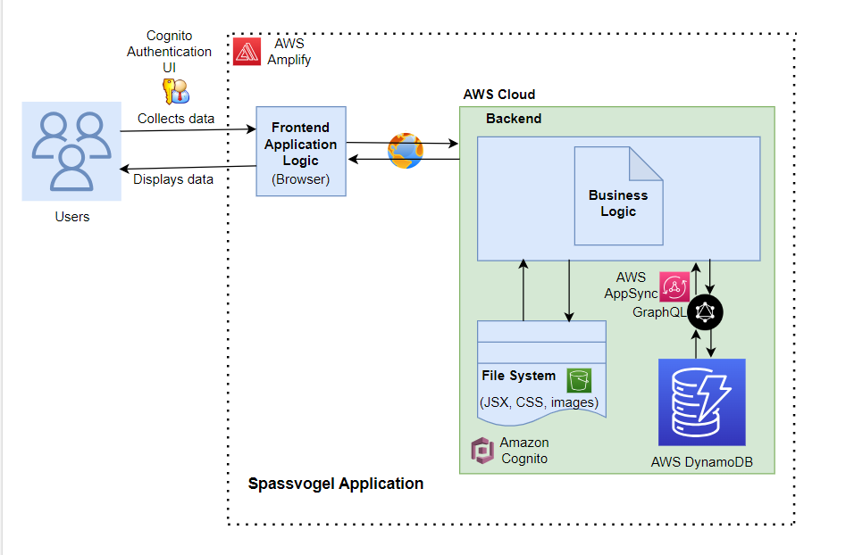
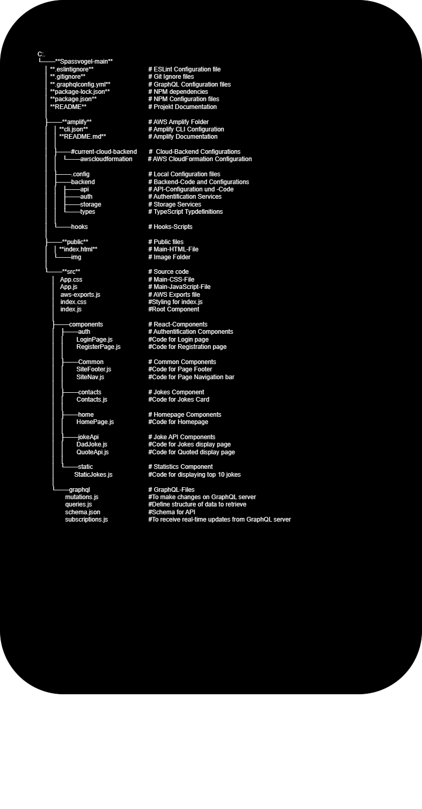

# Getting Started with Create React App

This project was bootstrapped with [Create React App](https://github.com/facebook/create-react-app).

## Available Scripts

In the project directory, you can run:

### `npm start`

Runs the app in the development mode.\
Open [http://localhost:3000](http://localhost:3000) to view it in your browser.

The page will reload when you make changes.\
You may also see any lint errors in the console.

### `npm test`

Launches the test runner in the interactive watch mode.\
See the section about [running tests](https://facebook.github.io/create-react-app/docs/running-tests) for more information.

### `npm run build`

Builds the app for production to the `build` folder.\
It correctly bundles React in production mode and optimizes the build for the best performance.

The build is minified and the filenames include the hashes.\
Your app is ready to be deployed!

See the section about [deployment](https://facebook.github.io/create-react-app/docs/deployment) for more information.

### `npm run eject`

**Note: this is a one-way operation. Once you `eject`, you can't go back!**

If you aren't satisfied with the build tool and configuration choices, you can `eject` at any time. This command will remove the single build dependency from your project.

Instead, it will copy all the configuration files and the transitive dependencies (webpack, Babel, ESLint, etc) right into your project so you have full control over them. All of the commands except `eject` will still work, but they will point to the copied scripts so you can tweak them. At this point you're on your own.

You don't have to ever use `eject`. The curated feature set is suitable for small and middle deployments, and you shouldn't feel obligated to use this feature. However we understand that this tool wouldn't be useful if you couldn't customize it when you are ready for it.

## Learn More

You can learn more in the [Create React App documentation](https://facebook.github.io/create-react-app/docs/getting-started).

To learn React, check out the [React documentation](https://reactjs.org/).

### Code Splitting

This section has moved here: [https://facebook.github.io/create-react-app/docs/code-splitting](https://facebook.github.io/create-react-app/docs/code-splitting)

### Analyzing the Bundle Size

This section has moved here: [https://facebook.github.io/create-react-app/docs/analyzing-the-bundle-size](https://facebook.github.io/create-react-app/docs/analyzing-the-bundle-size)

### Making a Progressive Web App

This section has moved here: [https://facebook.github.io/create-react-app/docs/making-a-progressive-web-app](https://facebook.github.io/create-react-app/docs/making-a-progressive-web-app)

### Advanced Configuration

This section has moved here: [https://facebook.github.io/create-react-app/docs/advanced-configuration](https://facebook.github.io/create-react-app/docs/advanced-configuration)

### Deployment

This section has moved here: [https://facebook.github.io/create-react-app/docs/deployment](https://facebook.github.io/create-react-app/docs/deployment)

### `npm run build` fails to minify

This section has moved here: [https://facebook.github.io/create-react-app/docs/troubleshooting#npm-run-build-fails-to-minify](https://facebook.github.io/create-react-app/docs/troubleshooting#npm-run-build-fails-to-minify)

# Project Overview
This is a website where users can read and enjoy a wide range of jokes and meaningful quotes. They can also interact with the website by contributing their jokes which are then stored in the database. It also displays the top ten jokes based on the user ratings.

## Demo
Check out the live demo of the website:[Demo Link](https://dev.d2ja606fvd2z0i.amplifyapp.com)

# To use this website follow these steps :
Click on the link [Demo Link](https://dev.d2ja606fvd2z0i.amplifyapp.com)
 - Enter verification code from your Email to register on the website
 - After registration you can login to the website and navigate to different parts of the website

 
 
# Feature of this website:
The website has been built with the aim of adding some fun to the users’ daily life. It has a huge database of a variety of jokes to make sure that no joke is repeated often.
It also keeps the users engaged by providing them an opportunity to contribute their own jokes. This helps us to grow the database and reach a larger audience.
The website is built using AWS Amplify with React.js. Amplify simplifies a lot of backend tasks like connection with the DynamoDB, Cognito, S3 storage and GraphQL API to fetch jokes and quotes.
The frontend of the website has a very user-friendly UI which is designed using Bootstrap CSS framework that provides a large variety of components like buttons, forms, div, carousels, etc which are easy to implement.
The registration process works with the Authentication UI on the homepage which integrates with the AWS Cognito at the backend which makes the website secure.
The website is deployed using Amplify by linking it directly to the Github repository. Amplify takes care of the continuous integration and continuous development. If there are any changes to the code in the Github repository the website in the cloud is automatically updated accordingly.
Possibilities for future improvements of the website:
Since the application is built using AWS Amplify, in future it can be extended to mobile devices by using React Native.
With the use of Cognito we can also implement further features like Multi Factor Authentication(MFA) and user profile management on the website.
We can also implement a functionality where users can also comment on a joke along with rating.
Also we can attract more users by giving out prizes for the users whose jokes make it to the top 10 jokes list.

# Data Structure :

# Learn More
The online resources which have been used to build this website are listed below. You can check out these resources to understand more.
 - AWS Amplify documentation
   - https://aws.amazon.com/amplify/
 - Amplify UI
   - https://ui.docs.amplify.aws/react/getting-started/accessibility
 - AWS Command Line Interface
   - https://aws.amazon.com/cli/
 - GraphQL website
   - https://graphql.org/
 - Youtube videos to learn about implementing AWS Amplify in a full-stack web application
   - https://www.youtube.com/watch?v=EkQm78ElnoI&list=PLRBkbp6t5gM1Gc6IDS1wIRSw-oSS-fpi1&index=1

 - To fetch quotes/jokes from API : Random Quote Generator - React
   - https://www.youtube.com/watch?v=OpXpwY9Gbzg
  
 - To code star rating feature in the application : How to Create a Star Rating Component in React
   - https://www.youtube.com/watch?v=9sSBMF8K7sY

 - To code bar graph showing top 10 jokes : Create Charts in React
   - https://www.youtube.com/watch?v=-CwzaTKniH4

 - Bootstrap documentation
   - https://react-bootstrap.github.io/

# User Contributions
It would be very helpful if you can report bugs which you find on the website. It helps us to improve it further. 
